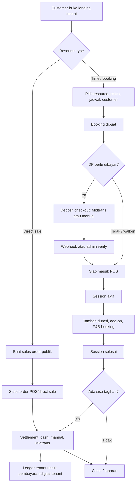

# Booking -> Session/POS -> Checkout Trace

Dokumen ini dipakai untuk menelusuri backbone operasional Bookinaja dari customer memilih resource sampai tenant menerima pembayaran. Fokusnya adalah alur yang paling sering dipakai dan paling berpengaruh ke revenue tenant.

## Prinsip Domain

- Booking adalah transaksi berbasis waktu untuk resource seperti PC, room, lapangan, studio, atau layanan berdurasi.
- POS adalah command center kasir untuk sesi aktif, sesi yang akan mulai, transaksi yang perlu pelunasan, dan direct sale.
- Checkout memisahkan tiga cara bayar: tunai dicatat kasir, pembayaran manual perlu verifikasi, gateway Midtrans diverifikasi otomatis.
- F&B punya dua mode: masuk ke tagihan booking atau berdiri sendiri sebagai transaksi menu.
- Ledger tenant adalah saldo transaksi tenant yang diproses melalui Bookinaja, bukan revenue subscription Bookinaja.
- Subscription tenant adalah revenue platform Bookinaja dan tidak boleh masuk saldo tenant.

## Backbone Utama

## Trace 1: Public Tenant dan Customer Booking

Entry points:
- `GET /[tenant]` landing tenant menampilkan resource dari builder.
- `GET /[tenant]/bookings` katalog booking publik.
- `GET /[tenant]/bookings/[id]` detail resource, availability, form booking.
- `GET /[tenant]/orders/[id]` direct sale publik untuk resource non-timed.

Frontend yang perlu dicek:
- `frontend/src/components/tenant/public/landing/builder-renderer.tsx`
- `frontend/src/app/(dashboard)/[tenant]/(public)/bookings/page.tsx`
- `frontend/src/app/(dashboard)/[tenant]/(public)/bookings/[id]/page.tsx`
- `frontend/src/app/(dashboard)/[tenant]/(public)/orders/[id]/page.tsx`

Backend yang terlibat:
- `GET /public/resources`
- `GET /public/resources/:id`
- `GET /guest/availability/:resource_id`
- `POST /bookings`
- `POST /sales-orders/public`
- `POST /bookings/exchange-access-token`
- `POST /sales-orders/exchange-access-token`

Hal yang wajib ditrace:
- Kartu landing harus membedakan timed booking dan direct sale.
- Availability harus pakai timezone tenant, bukan timezone browser saja.
- Customer lama harus terisi dari validasi nomor HP atau customer session.
- Setelah booking/order dibuat, customer dapat redirect ke halaman verifikasi atau payment yang benar.

## Trace 2: Admin Create Booking

Entry points:
- `GET /admin/bookings/new`
- Mode scheduled booking.
- Mode walk-in booking.

Frontend:
- `frontend/src/app/(dashboard)/[tenant]/admin/(internal)/bookings/new/page.tsx`

Backend:
- `POST /bookings/manual`

State penting:
- Scheduled booking kembali ke `/admin/bookings`.
- Walk-in booking redirect ke `/admin/pos?active={booking_id}`.
- Booking mode walk-in bypass DP dan langsung relevan untuk sesi/POS.

Checklist:
- Buat scheduled booking dengan resource timed.
- Buat walk-in booking dan pastikan drawer POS langsung membuka sesi tersebut.
- Coba slot bentrok, slot lewat, dan jadwal di luar jam operasional.
- Coba promo supaya `grand_total`, `discount_amount`, `deposit_amount`, dan `balance_due` konsisten.

## Trace 3: Booking Detail Admin

Entry points:
- `GET /admin/bookings`
- `GET /admin/bookings/calendar`
- `GET /admin/bookings/[id]`
- `GET /admin/bookings/[id]/payment`

Frontend:
- `frontend/src/app/(dashboard)/[tenant]/admin/(internal)/bookings/page.tsx`
- `frontend/src/app/(dashboard)/[tenant]/admin/(internal)/bookings/calendar/page.tsx`
- `frontend/src/app/(dashboard)/[tenant]/admin/(internal)/bookings/[id]/page.tsx`
- `frontend/src/app/(dashboard)/[tenant]/admin/(internal)/bookings/[id]/payment/page.tsx`

Backend:
- `GET /bookings`
- `GET /bookings/:id`
- `PATCH /bookings/:id/status`
- `POST /bookings/:id/record-deposit`
- `POST /bookings/:id/override-deposit`
- `POST /bookings/:id/settle-cash`
- `POST /bookings/:id/manual-payment`
- `POST /bookings/payment-attempts/:attempt_id/verify`
- `POST /bookings/payment-attempts/:attempt_id/reject`

State transition:
- `pending` -> `confirmed` setelah DP valid atau override.
- `confirmed` -> `active` saat sesi dimulai.
- `active` -> `completed` saat sesi selesai.
- `completed` + `balance_due > 0` -> settlement.
- `completed` + `settled` -> selesai untuk laporan dan loyalty.

Checklist:
- Tombol mulai sesi tidak boleh aktif kalau DP wajib belum tercatat.
- Override DP harus punya alasan dan muncul di timeline.
- Payment page settlement baru aktif setelah sesi `completed`.
- Realtime event harus mengubah status di detail, list, POS, dan dashboard.

## Trace 4: POS dan Session Control

Entry point:
- `GET /admin/pos`

Frontend:
- `frontend/src/app/(dashboard)/[tenant]/admin/(internal)/pos/page.tsx`
- `frontend/src/components/pos/pos-control-hub.tsx`
- `frontend/src/components/pos/fnb-catalog-dialog.tsx`
- `frontend/src/components/pos/addons-catalog-dialog.tsx`

Backend:
- `GET /sales-orders/action-feed`
- `GET /bookings/active`
- `GET /bookings/:id`
- `POST /bookings/:id/extend`
- `POST /bookings/:id/orders`
- `POST /bookings/:id/addons`
- `PATCH /bookings/:id/status`

Prioritas action feed:
- Booking aktif atau overtime.
- Booking akan mulai dalam operational window.
- Booking completed yang masih perlu pelunasan.
- Sales order direct sale yang open, pending payment, paid, atau awaiting verification.

Checklist:
- Sesi aktif bisa tambah durasi, add-on, dan F&B.
- Add-on/F&B ditolak kalau sesi belum aktif atau sudah selesai.
- Extend session mengubah end time dan billing secara atomik.
- Sesi selesai harus memicu device standby/timeout kalau smartdevice aktif.
- POS drawer harus usable di mobile karena ini layar paling kasir-facing.

## Trace 5: Direct Sale / Sales Order

Entry points:
- Public direct sale dari landing untuk resource non-timed.
- Admin POS create direct sale.

Frontend:
- `frontend/src/app/(dashboard)/[tenant]/(public)/orders/[id]/page.tsx`
- `frontend/src/components/pos/pos-control-hub.tsx`

Backend:
- `POST /sales-orders`
- `GET /sales-orders`
- `GET /sales-orders/open`
- `GET /sales-orders/:id`
- `POST /sales-orders/:id/items`
- `PATCH /sales-orders/:id/items/:item_id`
- `DELETE /sales-orders/:id/items/:item_id`
- `POST /sales-orders/:id/checkout`
- `POST /sales-orders/:id/settle-cash`
- `POST /sales-orders/:id/payment-checkout`
- `POST /sales-orders/:id/manual-payment`
- `POST /sales-orders/payment-attempts/:attempt_id/verify`
- `POST /sales-orders/:id/close`

State transition:
- `open` saat order dibuat.
- `pending_payment` setelah checkout.
- `paid` setelah pembayaran lunas.
- `completed` setelah kasir menutup transaksi.

Checklist:
- Resource direct sale/hybrid saja yang boleh masuk sales order.
- Item tidak bisa diubah setelah `completed` atau `cancelled`.
- Cash settlement langsung settled.
- Gateway/manual mengikuti flow yang sama dengan settlement booking.
- Setelah paid, order masih perlu close supaya keluar dari action desk.

## Trace 6: F&B Menu dan Transaksi Menu

Entry points:
- `GET /admin/fnb`
- Modal F&B di booking live controller/POS.

Frontend:
- `frontend/src/app/(dashboard)/[tenant]/admin/(internal)/fnb/page.tsx`
- `frontend/src/components/fnb/fnb-item-dialong.tsx`
- `frontend/src/components/customer/booking-live-controller.tsx`

Backend:
- `GET /fnb`
- `POST /fnb`
- `PUT /fnb/:id`
- `DELETE /fnb/:id`
- `POST /fnb/orders`
- `GET /fnb/orders`
- `GET /fnb/orders/summary`
- `POST /bookings/:id/orders`

Domain rule:
- Menu catalog hanya master item.
- `fnb_orders` adalah transaksi menu aktual.
- Kalau `booking_id` ada, `fnb_orders.source = booking` dan item juga masuk `order_items` supaya billing booking ikut naik.
- Kalau `booking_id` kosong, `fnb_orders.source = standalone` dan transaksi berdiri sendiri.

Checklist:
- Transaksi menu standalone muncul di laporan F&B tanpa booking.
- Transaksi menu attached menaikkan `grand_total` dan `balance_due` booking.
- Payment method F&B harus customer-facing: Tunai, Transfer, QRIS, atau metode aktif tenant.
- Mobile modal F&B harus fullscreen, katalog/cart lebih dominan daripada catatan dan summary.

## Trace 7: Checkout dan Payment Attempt

Booking payment endpoints:
- `POST /billing/bookings/checkout`
- `POST /bookings/:id/manual-payment`
- `POST /bookings/:id/settle-cash`
- `POST /bookings/payment-attempts/:attempt_id/verify`
- `POST /bookings/payment-attempts/:attempt_id/reject`

Sales order payment endpoints:
- `POST /sales-orders/:id/payment-checkout`
- `POST /sales-orders/:id/manual-payment`
- `POST /sales-orders/:id/settle-cash`
- `POST /sales-orders/payment-attempts/:attempt_id/verify`
- `POST /sales-orders/payment-attempts/:attempt_id/reject`

Payment scopes:
- Booking DP: `payment_scope = deposit`, Midtrans order id `bk-{booking_id}-dp`.
- Booking settlement: `payment_scope = settlement`, Midtrans order id `bk-{booking_id}-due`.
- Sales order settlement: `payment_scope = settlement`, Midtrans order id `so-{sales_order_id}-settlement`.

Checklist:
- Cash tidak tersedia untuk DP customer, hanya untuk pelunasan kasir.
- Manual payment tidak boleh punya dua attempt aktif untuk scope yang sama.
- Gateway checkout harus membuat payment attempt sebelum snap dibuka.
- Settlement booking harus menolak status selain `completed`.
- Admin verify manual harus restore status dengan benar saat reject.

## Trace 8: Midtrans Webhook dan Ledger Tenant

Backend:
- `backend/internal/platform/midtrans/service.go`
- `backend/internal/platform/midtrans/repository.go`
- `backend/internal/billing/repository.go`

Webhook fungsi:
- Validasi signature Midtrans.
- Catat semua notifikasi ke `midtrans_notification_logs`.
- Bedakan order id:
  - `sub-*`: subscription tenant, revenue Bookinaja.
  - `bk-*`: booking payment tenant.
  - `so-*`: sales order/direct sale tenant.
- Update status booking/order dan payment attempt.
- Buat realtime event.
- Untuk final status booking/sales order, buat `tenant_ledger_entries`.

Ledger tenant fungsi:
- Mencatat saldo milik tenant yang diproses melalui Bookinaja.
- Source valid: `booking_payment`, `sales_order_payment`, `refund`, `payout`, `adjustment`.
- Summary saldo = settled credit - settled debit.
- Subscription tidak masuk ledger tenant karena itu revenue platform Bookinaja.

Checklist laporan:
- Laporan saldo tenant tidak boleh menampilkan subscription.
- Laporan Midtrans tenant tidak boleh menampilkan order `sub-*`.
- Copywriting customer-facing:
  - "Saldo tenant" lebih jelas dari "ledger tenant".
  - "Riwayat pembayaran digital" lebih jelas dari "Midtrans webhook".
  - "Masuk saldo" lebih jelas dari "net".
  - "Nomor pembayaran" lebih jelas dari "order id".
  - "Nomor transaksi" lebih jelas dari "transaction id".

## Trace 9: Reports

Frontend:
- `frontend/src/app/(dashboard)/[tenant]/admin/(internal)/reports/page.tsx`
- `frontend/src/app/(dashboard)/[tenant]/admin/(internal)/reports/report-detail-client.tsx`
- `frontend/src/app/(dashboard)/[tenant]/admin/(internal)/reports/revenue/page.tsx`
- `frontend/src/app/(dashboard)/[tenant]/admin/(internal)/reports/transactions/page.tsx`
- `frontend/src/app/(dashboard)/[tenant]/admin/(internal)/reports/ledger/page.tsx`
- `frontend/src/app/(dashboard)/[tenant]/admin/(internal)/reports/midtrans/page.tsx`

Backend:
- `GET /reports/revenue`
- `GET /reports/transactions`
- `GET /reports/fnb`
- `GET /reports/customers`
- `GET /reports/ledger`
- `GET /reports/midtrans-notifications`

Checklist:
- Revenue tenant harus gabungan booking, direct sale, dan F&B sesuai report kind.
- Customer spend harus menghitung transaksi settled/paid yang valid.
- Ledger hanya untuk uang tenant yang nyangkut/diproses Bookinaja.
- Platform admin revenue baru boleh mencampur subscription revenue Bookinaja dan booking balance tenant, tapi labelnya harus eksplisit.

## Urutan QA End-to-End

1. Public timed booking: landing -> resource -> booking -> DP gateway/manual -> customer live.
2. Admin scheduled booking: create booking -> booking detail -> record/override DP -> start session.
3. Walk-in booking: create booking mode walk-in -> auto open POS -> start/active session.
4. Active session: extend duration -> add add-on -> add F&B attached -> verify total berubah.
5. Complete session: status completed -> POS/payment page menampilkan settlement.
6. Settlement cash: kasir lunasi cash -> status settled -> receipt/customer stats.
7. Settlement manual: submit manual -> awaiting verification -> verify/reject -> realtime.
8. Settlement Midtrans: create snap -> webhook final -> payment attempt paid -> ledger tenant.
9. Direct sale admin: create POS sales order -> add item -> checkout -> cash/manual/Midtrans -> close.
10. Public direct sale: landing -> order -> customer payment -> admin reports.
11. F&B standalone: admin menu -> catat penjualan -> laporan F&B source standalone.
12. Reports: revenue, transactions, saldo tenant, riwayat pembayaran digital, customer report.

## Crucial Backbone yang Paling Memberi Value

- Landing tenant dan public booking adalah customer acquisition surface.
- Admin booking create adalah operational intake untuk staff.
- POS/action feed adalah layar paling sering dipakai kasir karena menggabungkan start session, live control, add-on, F&B, dan settlement.
- Checkout/payment attempt adalah revenue capture layer; bug di sini langsung berdampak ke uang tenant.
- Midtrans webhook dan ledger adalah settlement truth untuk saldo tenant dan payout.
- Reports adalah trust layer: tenant harus bisa melihat transaksi masuk, saldo, dan performa tanpa istilah developer.

## Risiko yang Perlu Dijaga

- Copy laporan yang developer-facing membuat tenant salah paham antara revenue tenant dan revenue Bookinaja.
- Flow F&B attached dan standalone bisa dobel hitung kalau report tidak jelas sumbernya.
- Settlement booking sebelum sesi selesai harus tetap ditolak supaya status sesi dan status pembayaran tidak rancu.
- Subscription `sub-*` tidak boleh masuk ledger tenant.
- Mobile POS dan modal transaksi harus diutamakan karena staff operasional sering memakai layar kecil.
