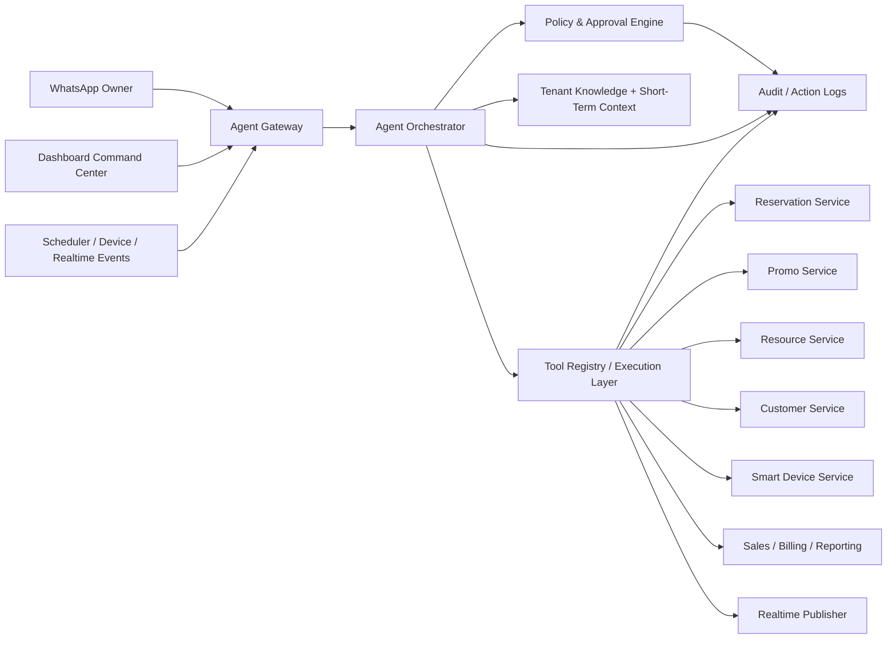

# Bookinaja GaaS System Design V1

## Goal

Mengubah Bookinaja dari SaaS operasional booking menjadi GaaS yang memungkinkan owner:

- bertanya ke agent
- menerima rekomendasi operasional
- menyetujui tindakan bisnis
- mendelegasikan eksekusi booking, promo, dan monitoring

Target awal bukan membuat agent yang bisa melakukan semua hal, tetapi membuat `agent yang sempit, dapat diaudit, dan aman dipakai owner nyata`.

## Product Positioning

Bookinaja GaaS dijual sebagai:

- `AI Booking Assistant`
- `AI Revenue Assistant`
- `AI Ops Guard`
- `AI Command Center`

Agent bukan pengganti backend inti. Agent adalah lapisan percakapan, reasoning, dan delegasi di atas business services yang sudah ada.

## Design Principles

1. `LLM as planner, backend as executor`
2. `No direct DB write from LLM`
3. `Sensitive actions require approval`
4. `Everything is logged`
5. `Start narrow, expand by validated workflows`
6. `WA for speed, web for control`

## Current Repo Foundations

Fondasi yang sudah ada di repo sudah cukup kuat untuk GaaS:

- booking and reservation flow:
  - `backend/internal/reservation`
- promo engine:
  - `backend/internal/promo`
- resources and availability domain:
  - `backend/internal/resource`
- customer and tenant data:
  - `backend/internal/customer`
  - `backend/internal/tenant`
- smart device orchestration:
  - `backend/internal/smartdevice`
- realtime infra:
  - `backend/internal/platform/realtime`
- MQTT integration:
  - `backend/internal/platform/mqtt`
- billing and sales:
  - `backend/internal/billing`
  - `backend/internal/sales`
- frontend dashboard foundation:
  - `frontend/src/app/(dashboard)/[tenant]/admin/(internal)`

Artinya MVP GaaS tidak perlu memindahkan core stack. Yang dibutuhkan adalah `agent layer`, `approval workflow`, `audit model`, dan `channel adapters`.

## Owner Communication UX

### WhatsApp UX

WhatsApp dipakai untuk:

- alert
- quick ask
- approval
- status update

Karakter UX:

- pesan singkat
- satu keputusan per pesan
- ada CTA jelas
- jika butuh konfigurasi kompleks, arahkan ke dashboard

Contoh flow:

1. Agent mendeteksi okupansi Sabtu rendah.
2. Agent kirim notifikasi WA.
3. Owner balas `1`, `YA`, atau nilai baru.
4. Agent validasi policy tenant.
5. Jika lolos, agent mengeksekusi tool.
6. Agent kirim hasil.

Contoh pesan:

> Booking Sabtu 17 Mei 2026 baru 31%. Saya sarankan promo 10% jam 09.00-13.00. Estimasi tambahan 4 booking. Balas: 1 Setuju, 2 Ubah, 3 Tolak.

### Web Dashboard UX

Web adalah command center utama.

Komponen utama:

- `Agent Chat`
- `Suggested Actions`
- `Approvals Queue`
- `Insights`
- `Audit Timeline`
- `Agent Settings`

Contoh flow:

1. Owner membuka dashboard tenant.
2. Ringkasan agent menampilkan alert, rekomendasi, dan aksi tertunda.
3. Owner mengirim prompt:
   - `Buat analisis jam sepi minggu ini`
4. Agent menjawab dengan insight dan action card.
5. Owner klik approve atau revise.
6. Eksekusi disimpan ke log dan dashboard memperbarui status realtime.

### Channel Split

- `WA` = notify, approve, ask cepat
- `Web` = supervise, analyze, configure, override

## Realistic Conversation Examples

### Owner via WhatsApp

Owner:

> Cek besok rame gak?

Agent:

> Sabtu 17 Mei 2026 saat ini terisi 31%. Jam paling sepi 09.00-13.00. Saya sarankan promo 10%. Mau saya aktifkan?

Owner:

> Coba 15%

Agent:

> Saya siapkan promo 15% untuk Sabtu 17 Mei 2026 jam 09.00-13.00. Balas YA untuk konfirmasi.

Owner:

> YA

Agent:

> Promo berhasil dipublish dan landing page sudah diperbarui.

### Owner via Web

Owner:

> Tampilkan pendapatan minggu ini dan unit mana yang perlu promo.

Agent:

> Pendapatan minggu ini Rp12.450.000, turun 8% dari minggu lalu. Penurunan terbesar ada di Lapangan B pada jam 10.00-14.00 hari kerja. Saya sarankan promo weekday 10% atau bundling 2 jam plus minuman. Mau saya siapkan draft promo?

Owner:

> Tampilkan simulasi bundling dulu.

Agent:

> Estimasi okupansi naik 7% dengan margin lebih sehat daripada diskon langsung. Saya rekomendasikan bundling.

### Owner via WA for Device Control

Agent:

> PC 05 masih menyala, tapi sesi berakhir pukul 21.00. Tidak ada extend aktif. Saya akan matikan dalam 1 menit kecuali dibatalkan. Balas STOP untuk batalkan.

Owner:

> Lanjut

Agent:

> PC 05 dimatikan paksa pukul 21.02. Insiden sudah dicatat.

## Scope of V1

V1 fokus pada owner-side GaaS:

- command center di web
- WA alert + approval
- owner QnA
- promo recommendation
- assisted booking action

V1 belum perlu:

- agent customer-facing full public
- autonomous pricing tanpa approval
- free-form multi-agent planning
- auto-write ke seluruh setting bisnis

## Core Capabilities

### 1. QnA Agent

Tugas:

- jawab omzet
- jawab okupansi
- jawab booking status
- jawab performa resource

Mode:

- read-only

### 2. Recommendation Agent

Tugas:

- identifikasi jam sepi
- usulkan promo
- usulkan follow-up customer
- usulkan tindakan operasional

Mode:

- read-only analysis
- action by approval

### 3. Action Agent

Tugas:

- create booking
- publish promo
- send owner notification
- request approval
- update page theme in bounded scope

Mode:

- tool-driven
- approval-aware

### 4. Ops Guard Agent

Tugas:

- deteksi anomali device
- deteksi session ended but device active
- kirim warning
- eksekusi shutdown jika policy mengizinkan

## System Architecture



## Runtime Components

### 1. Channel Adapters

Functions:

- normalize inbound messages
- attach tenant context
- attach owner identity and role
- map outbound responses to channel format

Adapters:

- WhatsApp adapter
- dashboard chat adapter
- event adapter

### 2. Agent Gateway

Responsibilities:

- receive inbound requests
- resolve `tenant_id`, `actor_id`, `channel`, `session_id`
- create `agent_session`
- route to orchestrator

Suggested implementation:

- Go HTTP handlers under new module:
  - `backend/internal/agentgateway`

### 3. Agent Orchestrator

Responsibilities:

- classify intent
- choose prompt template
- decide whether to retrieve knowledge
- select tools
- interpret tool results
- decide if approval is required
- produce final response

Implementation options:

- `Recommended V1`: custom orchestrator in Go using OpenAI Responses API or Chat Completions with tool calling
- `Optional V2`: LangGraph sidecar if workflow complexity grows

Recommendation:

- start with custom Go orchestrator
- avoid heavy framework dependency in V1

### 4. Tool Registry / Execution Layer

Responsibilities:

- expose typed tools to LLM
- validate arguments
- enforce tenant scoping
- enforce role and approval policy
- map tool calls to existing services

Suggested module:

- `backend/internal/agenttools`

### 5. Policy and Approval Engine

Responsibilities:

- mark actions as read-only, approval-required, or auto-allowed
- enforce per-tenant limits
- issue approval requests
- track expiration and final state

Suggested module:

- `backend/internal/agentpolicy`

### 6. Audit and Observability

Track:

- prompt class used
- tool called
- tool arguments
- approval requested
- approval actor
- execution status
- latency
- model and token usage

Suggested module:

- `backend/internal/agentaudit`

## Recommended Stack

### Core

- `Go` for API, orchestrator, and execution layer
- `PostgreSQL` for operational data and agent logs
- `Redis` for session cache, rate limiting, and transient context
- `WebSocket` for command center realtime updates
- `MQTT` for smart device actions

### AI

- `OpenAI GPT-4o mini` for default operations
- `OpenAI GPT-4.1` for heavier analysis or summarization if needed

Usage strategy:

- default all owner chat to cheaper model
- escalate only for long-form analytics or ambiguous requests

### Knowledge / Retrieval

- `pgvector` in PostgreSQL

Documents stored:

- tenant SOP
- promo policy
- FAQ
- business rules
- copy guidelines
- device handling rules

### Messaging

- WhatsApp Business API via provider
- recommended abstraction:
  - `backend/internal/platform/whatsapp`

### Async / Eventing

- `NATS` recommended for internal events
- acceptable V1 fallback:
  - Postgres-backed scheduler + existing async jobs if event bus not ready

## Tool Contracts

Semua tool harus:

- typed
- validated
- tenant-scoped
- deterministic in output shape
- idempotent where possible

Initial tool set:

### Read-only tools

- `get_revenue_summary(tenant_id, date_from, date_to)`
- `get_occupancy_summary(tenant_id, date_from, date_to)`
- `get_low_occupancy_slots(tenant_id, target_date)`
- `check_availability(tenant_id, date, time_range, resource_type)`
- `get_booking_detail(tenant_id, booking_id)`
- `get_resource_status(tenant_id, resource_id)`
- `get_active_device_anomalies(tenant_id)`

### Approval-gated tools

- `publish_promo(tenant_id, promo_rule, schedule)`
- `create_manual_booking(tenant_id, customer, resource_id, start_at, end_at)`
- `turn_off_device(tenant_id, device_id, reason)`
- `broadcast_message(tenant_id, segment, message)`
- `update_landing_page_theme(tenant_id, theme_payload)`

### Internal support tools

- `request_action_approval(tenant_id, action_type, payload)`
- `send_owner_notification(tenant_id, channel, message)`
- `append_agent_audit_log(task_id, payload)`

## Existing Domain Mapping

V1 bisa memanfaatkan domain yang sudah ada:

- reservation tools map to:
  - `backend/internal/reservation`
- promo tools map to:
  - `backend/internal/promo`
- device tools map to:
  - `backend/internal/smartdevice`
- resource tools map to:
  - `backend/internal/resource`
- revenue and sales summary map to:
  - `backend/internal/sales`
  - `backend/internal/billing`
- tenant appearance changes map to:
  - `backend/internal/tenant`
  - frontend page builder flows already present under dashboard settings

## Policy Model

Setiap tenant perlu policy sendiri.

Suggested fields:

- `max_auto_discount_percent`
- `actions_requiring_approval`
- `auto_reply_enabled`
- `auto_reply_hours`
- `allowed_channels`
- `ops_guard_auto_shutdown_enabled`
- `ops_guard_grace_seconds`
- `daily_broadcast_limit`
- `model_tier`

Suggested default:

- promo publish requires approval
- device shutdown requires approval
- booking creation requires approval unless actor is owner
- read-only insight never requires approval

## Data Model

Tambahkan tabel baru.

### `agent_sessions`

Stores:

- tenant id
- actor id
- channel
- status
- last activity at

### `agent_messages`

Stores:

- session id
- role
- content
- structured payload
- model
- created at

### `agent_tasks`

Stores:

- tenant id
- source event
- intent
- state
- summary
- risk level
- created by system or user

### `agent_tool_calls`

Stores:

- task id
- tool name
- arguments json
- result json
- status
- started at
- finished at

### `agent_approvals`

Stores:

- task id
- action type
- channel
- requested payload
- status
- approved by
- expires at

### `agent_action_logs`

Stores:

- task id
- action type
- actor type
- actor id
- summary
- payload json
- created at

### `tenant_knowledge_documents`

Stores:

- tenant id
- document type
- title
- body
- embedding
- source
- updated at

### `tenant_agent_policies`

Stores:

- tenant id
- policy json or normalized columns
- updated by
- updated at

## Suggested API Surface

### Owner / dashboard endpoints

- `POST /api/agent/chat`
- `GET /api/agent/sessions/:id`
- `GET /api/agent/tasks`
- `GET /api/agent/approvals`
- `POST /api/agent/approvals/:id/approve`
- `POST /api/agent/approvals/:id/reject`
- `GET /api/agent/audit`
- `GET /api/agent/insights/summary`

### Channel / integration endpoints

- `POST /api/integrations/whatsapp/webhook`
- `POST /api/agent/events/device-anomaly`
- `POST /api/agent/events/scheduler`

## Prompt Architecture

Jangan pakai satu prompt besar untuk semua hal. Pisahkan per workflow.

### System prompt base

Contains:

- role as Bookinaja owner assistant
- safety boundaries
- no guessing policy
- tenant scope restriction
- approval rules

### Prompt packs

- `owner_qna_prompt`
- `revenue_recommendation_prompt`
- `booking_assistant_prompt`
- `ops_guard_prompt`
- `theme_update_prompt`

### Prompt pattern

Every prompt should define:

- goal
- allowed tools
- forbidden actions
- output format
- approval behavior

Example behavior rules:

- never claim booking exists before calling tool
- never publish promo without approval
- never control device without checking active booking state
- keep WA responses short
- keep dashboard responses structured with summary and next actions

## Approval UX Design

### WhatsApp approval pattern

Format:

- context
- recommendation
- impact summary
- response options

Example:

> Lapangan B sepi untuk Sabtu 17 Mei 2026 jam 09.00-13.00. Rekomendasi promo 10%. Estimasi tambahan omzet Rp650.000. Balas: 1 Setuju, 2 Ubah, 3 Tolak.

### Dashboard approval card

Fields:

- title
- why this is suggested
- expected impact
- exact action payload
- approve button
- revise button
- reject button

## Wireframe Sketches

### Dashboard Command Center

```text
+---------------------------------------------------------------+
| Header: Tenant | Realtime | Pending Approvals | Agent Status  |
+----------------------+----------------------------------------+
| Left Sidebar         | Main Chat / Task View                  |
| - Dashboard          | ------------------------------------   |
| - Bookings           | Owner: Tampilkan jam sepi minggu ini   |
| - Resources          | Agent: Ringkasan + charts + actions    |
| - Promo              | [Action Card: Publish Promo]           |
| - Agent Command      | [Action Card: Notify Customers]        |
| - Audit              |                                        |
+----------------------+-------------------+--------------------+
| Suggested Actions                        | Approval Queue     |
| - Promo Sabtu 10%                        | - Promo #A12       |
| - Follow up pelanggan pasif              | - Device #PC05     |
+------------------------------------------+--------------------+
```

### WhatsApp Interaction Pattern

```text
Agent:
[Context singkat]
[Saran]
[Dampak]
[CTA]

Owner:
YA / TOLAK / UBAH 15%
```

## Execution Flows

### Flow 1: Revenue recommendation

1. Scheduler memicu check H+1 occupancy.
2. Tool membaca reservation and resource utilization.
3. Agent membuat recommendation.
4. Approval request dikirim ke WA dan dashboard.
5. Owner approve.
6. Promo service publish promo.
7. Realtime update dikirim.
8. Audit log ditulis.

### Flow 2: Owner asks for insight

1. Owner kirim prompt dari dashboard.
2. Agent gateway membuat session dan task.
3. Orchestrator memanggil insight tools.
4. Agent menyusun jawaban dan suggested actions.
5. Frontend merender chart and cards.

### Flow 3: Device anomaly

1. Device event or reconciler mendeteksi mismatch.
2. Event masuk ke agent event endpoint.
3. Ops guard mengecek booking state.
4. Jika policy butuh approval, kirim WA.
5. Jika approved, panggil smartdevice tool.
6. Simpan incident log.

## Security and Guardrails

Mandatory:

- every tool call enforces tenant scope from authenticated context
- LLM never receives raw DB credentials or query execution access
- prompt injection defenses on retrieved knowledge
- rate limit per tenant and actor
- approval TTL
- replay-safe approval tokens
- masked PII in logs where appropriate

## Observability

Track operationally:

- requests per channel
- tool call success rate
- approval conversion rate
- average response latency
- false recommendation feedback
- total token cost per tenant
- number of blocked unsafe actions

Suggested dashboards:

- `Agent Usage`
- `Approval Funnel`
- `Tool Reliability`
- `Cost by Tenant`

## Rollout Plan

### Phase 1: Foundation

Target:

- 2 weeks

Deliverables:

- agent data tables
- agent gateway
- owner dashboard chat endpoint
- 5 read-only tools
- audit logs

Success metric:

- owner can ask business questions from dashboard and receive accurate answers

### Phase 2: Approval Workflow

Target:

- 2 weeks

Deliverables:

- approval engine
- dashboard approval queue
- WhatsApp webhook adapter
- promo recommendation flow

Success metric:

- owner can approve promo suggestion from WA or dashboard

### Phase 3: Assisted Actions

Target:

- 2 weeks

Deliverables:

- publish promo tool
- booking creation tool
- device anomaly flow
- realtime UI updates

Success metric:

- at least one end-to-end owner action executed through agent

### Phase 4: Public-facing expansion

Target:

- after owner-side validation

Deliverables:

- customer booking agent
- tenant FAQ knowledge retrieval
- payment follow-up assistant

## MVP Sprint Plan 30 Hari

### Week 1

- create schema for agent tables
- define tool interfaces
- implement `POST /api/agent/chat`
- build owner QnA prompt

### Week 2

- add revenue summary and occupancy tools
- add dashboard command center shell
- render agent message history
- ship audit timeline

### Week 3

- implement approval model
- integrate WhatsApp webhook provider
- implement promo recommendation workflow
- add approve/reject actions

### Week 4

- implement publish promo tool
- implement device anomaly alert flow
- harden logs, retries, and observability
- run pilot on one tenant scenario

## Proposed Repo Additions

Backend:

- `backend/internal/agent`
- `backend/internal/agentgateway`
- `backend/internal/agenttools`
- `backend/internal/agentpolicy`
- `backend/internal/agentaudit`
- `backend/internal/platform/whatsapp`
- new migrations for agent tables

Frontend:

- `frontend/src/app/(dashboard)/[tenant]/admin/(internal)/agent/page.tsx`
- `frontend/src/components/agent/agent-command-center.tsx`
- `frontend/src/components/agent/approval-queue.tsx`
- `frontend/src/components/agent/suggested-actions.tsx`
- `frontend/src/components/agent/agent-chat-panel.tsx`

## Recommended First KPI Targets

- owner command response accuracy above 90% on validated queries
- first response under 5 seconds for read-only queries
- approval-to-action completion under 60 seconds on WA
- promo recommendation acceptance above 20% on pilot tenants

## What Not To Do In V1

- do not let the model generate SQL directly
- do not let the model modify arbitrary settings
- do not introduce multi-agent complexity too early
- do not launch public booking agent before owner workflow is trusted
- do not skip audit and approval design

## Final Recommendation

Bookinaja sebaiknya membangun GaaS dengan urutan berikut:

1. `owner command center`
2. `WA approval and alerts`
3. `promo and booking assisted actions`
4. `ops guard`
5. `customer-facing booking agent`

Ini menjaga agar GaaS Bookinaja lahir sebagai sistem yang bisa dijual, diaudit, dan dioperasikan dengan aman, bukan sekadar demo AI yang terlihat pintar tetapi rapuh.
